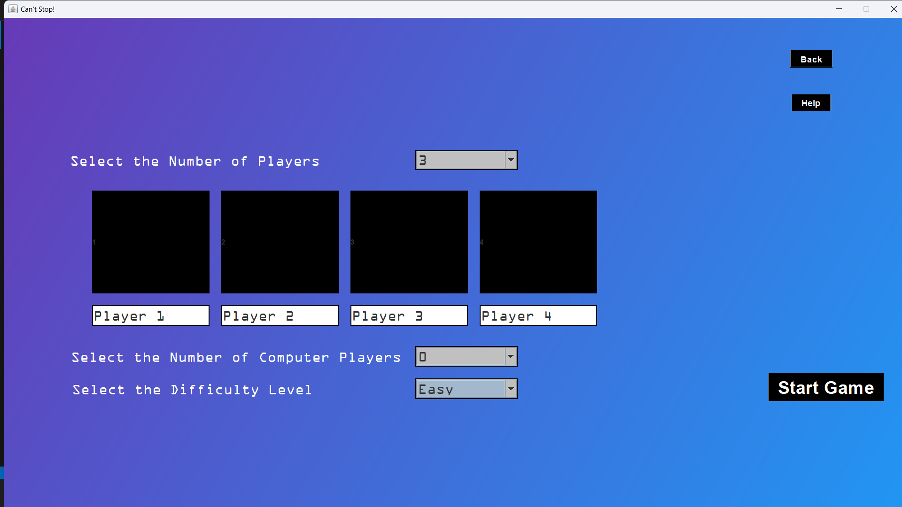
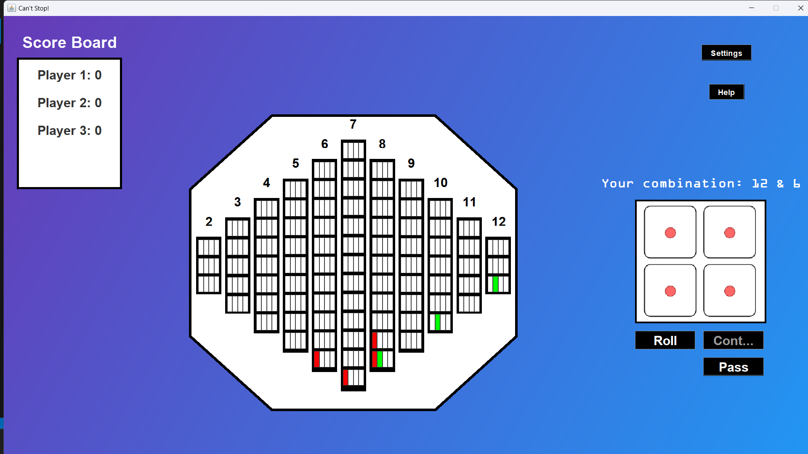

# Can't Stop Board Game

This is a digital replication of the Can't Stop board game developed using Java.

## How to Run

### Prerequisites
- Java Development Kit (JDK) installed
- An IDE like Eclipse or VSCode, or you can use the command line

### Steps to Run from Command Line
1. Clone the repository:
   ```sh
   git clone https://github.com/rajpa7el/Cant-Stop-Board-Game.git
   cd Cant-Stop-Board-Game

2. **Compile the Java files: **
    ```sh
    javac -*.java

3. **Run the Game: **
    ```sh
    java Main

### Screenshots

- 
- 


